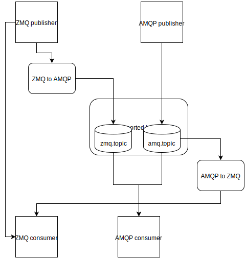

==================
Migration Overview
==================

Fedora's infrastructure makes heavy use of the event-driven services. In this
pattern, one service emits a message when a particular event occurs and a
different service uses that event to trigger some work.

As a concrete example, release-monitoring.org polls upstream projects for new
versions. When it discovers a new version, it emits a message. When
the-new-hotness receives this message, it tries to automatically update the
project's spec file and build a new version for testing.

Migrate from what?
==================

Fedora currently sends messages using ZeroMQ. ZeroMQ provides a familiar socket
API and all the basic building blocks necessary for common (and not-so-common)
message passing patterns.

Why Migrate?
============

Our current usage of ZeroMQ is limited to its PUB/SUB sockets. There's no
broker. Although it's true that a broker introduces a point of failure, the
broker offers a number of useful features out of the box like guaranteed
delivery, durable message queues, authentication and authorization, monitoring,
etc.

It's true ZeroMQ can be used to achieve all the features a broker like RabbitMQ
provides. It's a great library to start with if if you're interested in building
a message broker. Fedora shouldn't try to build a broker, though.

Why AMQP and RabbitMQ
=====================

The core requirements for Fedora is a messaging protocol that offers:

* Messages must be delivered to consumers at least once

* Clients must be authenticated to publish messages and authorized to publish
  using a given topic

RabbitMQ is a mature, well-established broker that supports AMQP v0.8.0,
v0.9.0, and v0.9.1 as well as 0.9.1 with a number of protocol extensions. It
also supports the STOMP (v1.0, v1.1, and v1.2) and MQTT (v3.1.1 at this time)
protocols via plugins.

We already run RabbitMQ in Fedora infrastructure and have some familiarity with
it. It supports authentication and `topic-based authorization`_. With the
RabbitMQ publisher ack extension, publishers can be confident their messages
were published and consumers will receive it at least once.

There are other message protocols: STOMP, MQTT, and AMQP 1.0 just to name a
few. There are other message brokers: Apache ActiveMQ, Qpid, and Mosquitto,
for example. Some other protocols are capable of meeting our needs, and the
broker Fedora infrastructure wishes to run is a choice best left to the system
administrators.

This document assumes AQMP and RabbitMQ for simplicity and to demonstrate a
concrete system that can meet Fedora's needs. It would be reasonably straight-
forward to implement the Python API (and message bridges) using, for example,
STOMP.

The Plan
========

This plan assumes the following requirements:

* No flag day.

* Don't disrupt any services or applications.

* Don't break any services outside of Fedora's infrastructure relying on these
  messages.

Deploy a Broker
---------------

The first step is to deploy a broker in Fedora to use. The broker should support
(at a minimum) AMQP. RabbitMQ is probably a safe choice, but other brokers that
support AMQP (0.9.1) are fine.

Building Bridges
----------------

In order to avoid a flag day, bridges from AMQP to ZeroMQ and ZeroMQ to AMQP
need to be implemented and deployed. Some care needs to be taken to ensure
messages don't get looped endlessly between AMQP and ZeroMQ. In order to avoid
endless loops, two AMQP topic exchanges will be used. These will be used to
separate those messages originally published to ZeroMQ from those originally
published to AMQP. We'll call these exchanges "amq.topic" and "zmq.topic". The
setup is as follows:

1. The ZeroMQ to AMQP bridge publishes message to the "zmq.topic"
   exchange, using the ZeroMQ topic as the AMQP topic.

2. AMQP publishers publish to the "amq.topic" exchange.

3. The AMQP to ZeroMQ bridge binds a queue to the "amq.topic" exchange and
   publishes all messages to a ZeroMQ PUB socket. This socket is added to the
   list of sockets all fedmsg consumers connect to.

4. When a ZeroMQ consumer is migrated to AMQP, the queue it sets up is bound
   to both the "zmq.topic" and "amq.topic" with the topics it's interested in.

   A diagram of how messages are routed using the AMQP <-> ZMQ bridging.

This allows both fedmsg publishers and subscribers to migrate at their leisure.
Once all Fedora services are migrated, the ZeroMQ to AMQP bridge can be turned
off. If Fedora wishes to continue supporting the external ZeroMQ interface, the
AMQP to ZeroMQ bridge should continue to be run.

Testing
-------

In order to validate that the bridges are functioning, a small service will be
run during the transition period that connects to fedmsg and to the AMQP queues
to compare messages. This will help catch format changes, configuration issues
that lead to message loss, etc. It will also likely have false positives since
ZeroMQ PUB/SUB sockets are designed to be unreliable and determining if a
message is lost or merely slow to be delivered is a difficult problem.

An initial implementation of this service is provided by these tools, see the
fedmsg-migration-tools CLI for details.

Converting Applications
-----------------------

After the bridges are running, applications are free to migrate. Rather than
attempting to add support to the existing fedmsg APIs, a new API has been
created. The reason for this is that the fedmsg API doesn't offer useful
exceptions on errors and has a huge dependency chain we don't need.

This new library, `fedora-messaging`_, handles a lot of the boilerplate code and
offers some useful APIs for the simple publisher and consumer. However, users are
free to use the AMQP client libraries directly if they so choose.

Supporting External Consumers
-----------------------------

Access to the AMQP broker won't be available to outside consumers, so even
after all applications have migrated to AMQP, we can continue to run the AMQP
to ZeroMQ bridge so external users can receive messages via ZeroMQ.

Demo
====

Using the fedora-messaging library, fedmsg-migration-tools offers alpha-quality
implementations of the bridges as well as the verification service. You can
set these up at home with relative ease:

1. Install RabbitMQ. On Fedora, ``sudo dnf install rabbitmq-server``

2. Start RabbitMQ: ``sudo systemctl start rabbitmq-server``

3. Enable the management plugin for a nice HTTP interface with ``sudo
   rabbitmq-plugins enable rabbitmq_management``

4. Navigate to http://localhost:15672/ and log in to see the monitoring
   dashboard. The default username is ``guest`` and the password is ``guest``.

5. Install the migration tools::

    mkvirtualenv --python python3 fedmsg_migration_tools
    pip install fedmsg-migration-tools

6. Start the ZeroMQ to AMQP bridge::

    fedmsg-migration-tools zmq_to_amqp --zmq-endpoint "tcp://fedoraproject.org:9940" --zmq-endpoint "tcp://release-monitoring.org:9940"

7. In a second terminal, start the AMQP to ZeroMQ bridge::

    workon fedmsg_migration_tools
    fedora-messaging consume --callback="fedmsg_migration_tools.bridges:AmqpToZmq"

8. Congratulations, you now have a functional bridge to and from AMQP. ZeroMQ
   messages are being published to the "zmq.topic" exchange, and any messages
   published to the "amq.topic" are bridged to ZeroMQ publishing sockets bound
   to all available interfaces on port 9940.

9. Run the verification service to confirm messages are available via both
   AMQP and ZeroMQ::

    fedmsg-migration-tools verify_missing --zmq-endpoint "tcp://fedoraproject.org:9940" --zmq-endpoint "tcp://release-monitoring.org:9940"

.. _fedora-messaging: https://fedora-messaging.readthedocs.io/en/latest/index.html
.. _topic-based authorization: https://www.rabbitmq.com/access-control.html#topic-authorisation
