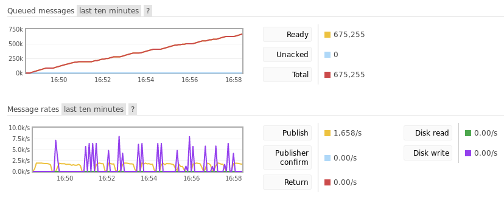
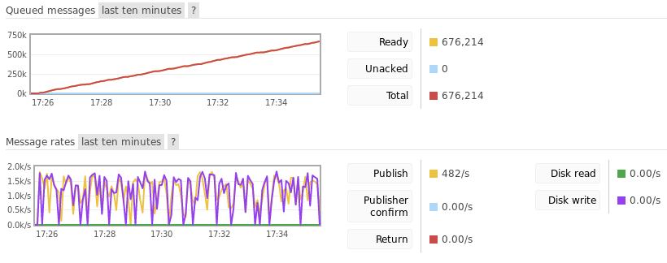
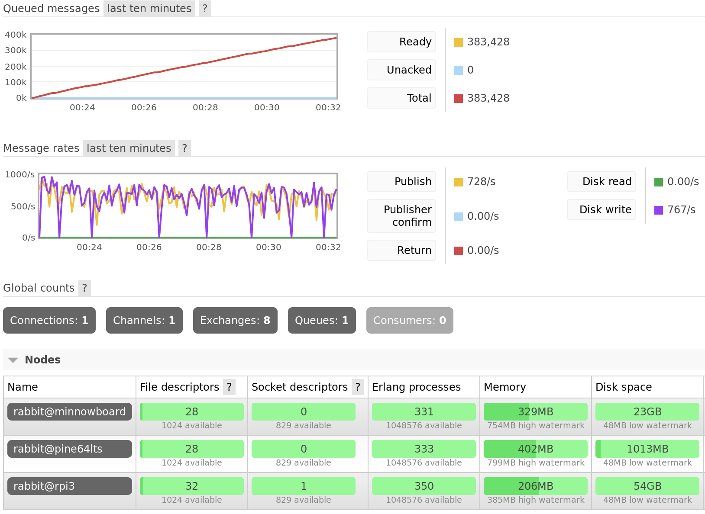

===========
Performance
===========

One concern about using a broker rather than ZeroMQ has been that a broker
could not keep up with the scale of Fedora's messaging needs. See the `old
fedmsg documentation`_ for details on these concerns. However, we now have a
multi-year history of messaging trends in Fedora's infrastructure thanks to
`datagrepper`_, and we can compare these with the throughput of RabbitMQ using
various durability settings, server configuration, and hardware.

Current Message Rates
=====================

Datagrepper connects to all ZeroMQ publishers and records the published
messages in a PostgreSQL database. Using this, we can get data about the number
of messages published per second.

.. note:: All numbers were collected using 1500 UTC on April 26, 2018 as the
          starting point.

* Over the last hour `3,905 messages were published
  <https://apps.fedoraproject.org/datagrepper/raw?rows_per_page=1&delta=3600&end=1524754800>`_
  which is on average 1.085 messages per second.

* Over the last 24 hours `70,802 messages were published
  <https://apps.fedoraproject.org/datagrepper/raw?rows_per_page=1&end=1524754800&delta=86400>`_
  which is on average 0.819 messages per second

* Over the last 4 weeks, `1,653,835 messages were published
  <https://apps.fedoraproject.org/datagrepper/raw?rows_per_page=1&end=1524754800&delta=2419200>`_
  which is on average 0.684 messages per second

* Over the last 365.25 days, `20,896,220 messages were published
  <https://apps.fedoraproject.org/datagrepper/raw?rows_per_page=1&end=1524754800&delta=31557600>`_
  which is on average 0.662 messages per second

Obviously, these are just averages and will vary by time of day, year, etc.

RabbitMQ Performance
====================

Before looking at actual numbers, it is important to understand what affects
RabbitMQ's performance. Note that these are all trade-offs between reliability
and performance, so we are free to tweak them as necessary to get the balance
we want.

Publishing
----------

The largest factor that impacts publishing is the level of durability used.

* Transient - Messages are not durable; if the broker restarts queued messages
  are lost. Messages may be paged out to disk if there are memory constraints,
  of course.

* Durable without transactions - Messages persist across broker restarts.
  However, publishers receive an acknowledgment from the broker before the
  message is persisted to disk so there is a window of time when messages can
  be lost without publishers knowing it.

* Durable with transactions - Use standard AMQP 0.9.1 channel transactions to
  ensure messages are published. According to `RabbitMQ documentation
  <https://www.rabbitmq.com/confirms.html#publisher-confirms>`_ this can
  decrease throughput by a factor of 250.

* Durable with Confirm extension - RabbitMQ extension to AMQP which sends an
  acknowledgment to the publisher only after the broker has successfully
  persisted the message in the same way consumers acknowledge messages.

Consuming
---------

When consuming, using a low pre-fetch value and acknowledging messages
individually can impact message through-put.

Both
----

* RabbitMQ `performs best when queues are empty
  <http://www.rabbitmq.com/blog/2011/09/24/sizing-your-rabbits/>`_. If messages
  are stacking up in queues, more CPU time is required per message.

* Queues are are bound to a single core. If a queue's throughput is too slow,
  multiple queues should be used if possible.

* In a high availability setup, queues can be mirrored to multiple nodes in the
  cluster, which adds additional latency to publishing and consuming.

The Numbers
-----------

Single Node Cluster
~~~~~~~~~~~~~~~~~~~

All numbers were obtained using a single node RabbitMQ 3.6.15 cluster running
on a Pine64 LTS which has a Cortex A-53 ARM processor and 2GB of RAM. The
publisher used Pika as the client with a blocking (synchronous) connection.

Transient Publishing
^^^^^^^^^^^^^^^^^^^^

With no consumer attached to the queue, message throughput peaked at around
2,000 messages per second. Since memory was limited, messages regularly had to
be paged out to the disk, during which time new messages were not accepted.
After 10 minutes, the queue accumulated 675,255 messages. The process memory
for the queue was approximately 55MB. Message bodies combined to be around 560MB.

   This image shows the RabbitMQ management console after 10 minutes of
   publishing. Note the dips in publishing due to paging messages out to
   permanent storage.

Durable Publishing
^^^^^^^^^^^^^^^^^^

With no consumer attached to the queue, message throughput peaked at around
1,500 messages per second. After around 10 minutes, the queue accumulated
676,214 messages.  Again, the process memory was approximately 55MB and message
bodies combined to be around 560MB. Interestingly, this performs as well as
transient messages, but this is likely due to the extremely limited memory on
the Pine64.

   This image shows the RabbitMQ management console after 10 minutes of
   publishing.

Three Node Cluster
~~~~~~~~~~~~~~~~~~

All numbers were obtained using a three node RabbitMQ 3.6.15 cluster running
on a Pine64 LTS, a Raspberry Pi 3B+, and a Minnowboard Turbot Dual-Core. The
publisher used Pika as the client with a blocking (synchronous) connection.
The queue was mirrored to all three nodes in the cluster.

Durable Publishing
^^^^^^^^^^^^^^^^^^

With no consumers attached to the queue, message throughput peaked at around
800 messages per second. After around 10 minutes, the queue accumulated 383,428
messages.

   Publishing to a queue mirrored across 3 nodes for 10 minutes.

.. _datagrepper: https://apps.fedoraproject.org/datagrepper/
.. _old fedmsg documentation: https://fedmsg.readthedocs.io/en/0.18/overview/#mq-or-going-for-broke-rless
